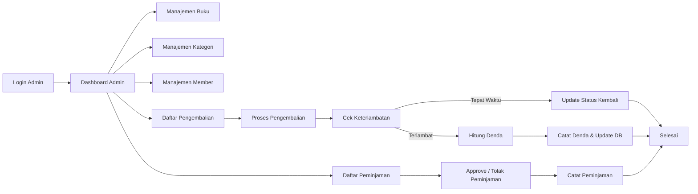
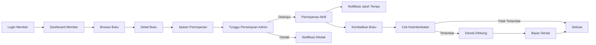
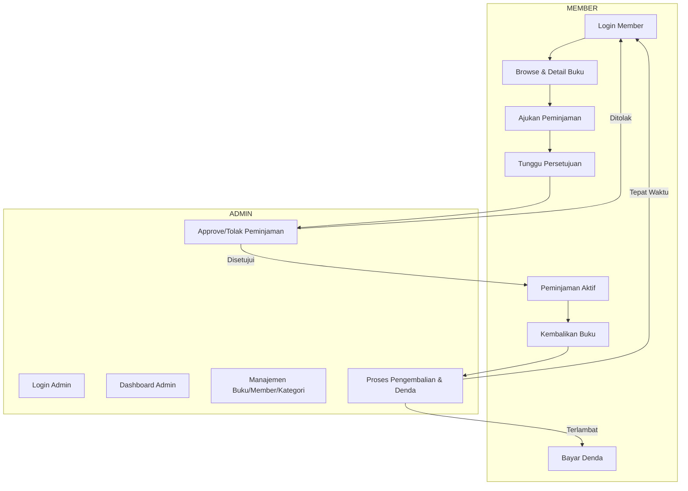

# Panduan Instalasi dan Penggunaan Aplikasi Sistem Perpustakaan Sekolah

## Persyaratan Sistem
- XAMPP (Apache, MySQL, PHP) versi terbaru
- Browser modern (Chrome, Firefox, Edge, dsb)

## Langkah Instalasi
1. **Download/Clone Project**
   - Unduh atau clone repository ini ke komputer Anda.
2. **Pindahkan ke htdocs**
   - Salin folder `Sistem-Perpustakaan-Sekolah` ke dalam folder `htdocs` di direktori instalasi XAMPP Anda (biasanya `C:/xampp/htdocs/`).
3. **Import Database**
   - Buka XAMPP Control Panel, aktifkan Apache dan MySQL.
   - Buka browser, akses `http://localhost/phpmyadmin`.
   - Buat database baru dengan nama `perpustakaan`.
   - Import file `database/perpustakaan.sql` ke database tersebut.
4. **Konfigurasi Koneksi Database**
   - Buka file `config/config.php`.
   - Pastikan pengaturan host, username, password, dan nama database sudah sesuai dengan konfigurasi MySQL Anda.
5. **Jalankan Aplikasi**
   - Buka browser dan akses `http://localhost/Sistem-Perpustakaan-Sekolah`.

## Cara Penggunaan Aplikasi

### Sebagai Admin
1. Login melalui halaman admin dengan username dan password admin yang sudah terdaftar di database.
2. Setelah login, Anda dapat:
   - Menambah, mengedit, dan menghapus data buku
   - Mengelola data anggota/member
   - Mengelola transaksi peminjaman dan pengembalian buku
   - Melihat dan mengelola denda keterlambatan
3. Gunakan menu navigasi di dashboard admin untuk mengakses fitur-fitur tersebut.

### Sebagai Member/Siswa
1. Daftar akun melalui halaman pendaftaran member.
2. Login menggunakan akun yang sudah dibuat.
3. Setelah login, Anda dapat:
   - Melihat daftar buku dan detail buku
   - Melakukan peminjaman buku
   - Melakukan pengembalian buku
   - Melihat status peminjaman, pengembalian, dan denda
4. Ikuti petunjuk pada setiap halaman untuk melakukan transaksi.

## Catatan Penting
- Pastikan XAMPP (Apache & MySQL) selalu aktif saat menggunakan aplikasi.
- Jika terjadi error koneksi database, cek kembali konfigurasi di `config/config.php`.
- Untuk menambah admin baru, lakukan langsung melalui database (phpMyAdmin) pada tabel `admin`.

---

# Sistem-Perpustakaan-Sekolah
Nama Project ini adalah : BookHaven

BookHaven adalah sebuah aplikasi berbasis website yang memberikan pelayanan berupa sistem peminjaman dan pengelolaan buku perpustakaan.

website ini dibuat menggunakan framework bootstrap, javascript, php dan database mysql.

Fitur fitur yang terdapat didalam aplikasi ini :
1. Memiliki 2 akses login, admin dan user/siswa .
2. Akses sebagai admin mendapatkan fasilitas berupa :
  - insert, update dan delete data buku
  - mencari buku berdasarkan judul dan kategori
  - mengelola data siswa yang daftar pada aplikasi
  - mengelola setiap peminjaman buku
  - mengelola setiap pengembalian buku
  - menerapkan denda jika siswa/user terlambat mengembalikan buku sesuai jadwal yang ditentukan.
3. Akses sebagai siswa mendapatkan fasilitas berupa :
  - dapat melihat isi seluruh buku yang ada dalam perpustakaan dan terdapat fitur filter buku berdasarkan kategori.
  - meminjam buku
  - mengembalikan buku
  - membayar denda

## Alur Aplikasi BookHaven

### 1. Sistem Akses dan Autentikasi

#### Portal Masuk Aplikasi
- **Landing Page** (`index.php`): Halaman utama BookHaven dengan informasi tentang perpustakaan
- **Portal Login** (`sign/link_login.html`): Interface pemilihan jenis login
  - **Admin Login** (`sign/admin/sign_in.php`): Login untuk administrator
  - **Member Login** (`sign/member/sign_in.php`): Login untuk siswa/member
  - **Member Registration** (`sign/member/sign_up.php`): Pendaftaran member baru

#### Proses Autentikasi
**Admin Authentication:**
- Input: nama_admin, password
- Validasi terhadap tabel `admin`
- Session: `$_SESSION["admin"]["nama_admin"]`

**Member Authentication:**
- Input: nama, nisn, password
- Validasi terhadap tabel `member` dengan password_verify()
- Session: `$_SESSION["member"]["nama"]` dan `$_SESSION["member"]["nisn"]`

### 2. Dashboard Admin (`DashboardAdmin/`)

#### Interface Admin
- **Main Dashboard** (`dashboardAdmin.php`): Overview statistik perpustakaan
- **Navigasi Sidebar**: Menu utama admin dengan fitur:
  - Dashboard overview
  - Manajemen buku (daftar, tambah, edit, hapus)
  - Manajemen kategori buku
  - Manajemen member/siswa
  - Manajemen peminjaman
  - Manajemen pengembalian
  - Sistem denda
  - Bantuan

#### Fitur Utama Admin

**Manajemen Buku:**
- **Daftar Buku** (`buku/daftarBuku.php`): Menampilkan semua buku dengan pencarian dan filter
- **Tambah Buku** (`buku/tambahBuku.php`): Form input buku baru dengan upload cover
- **Edit Buku** (`buku/editBuku.php`): Update informasi buku
- **Hapus Buku** (`buku/deleteBuku.php`): Menghapus buku dari sistem

**Manajemen Kategori:**
- CRUD kategori buku (bisnis, filsafat, informatika, novel, sains)

**Manajemen Member:**
- **Daftar Member** (`member/daftarMember.php`): Data semua siswa terdaftar
- **Tambah Member** (`member/tambahMember.php`): Registrasi member baru
- **Edit Member** (`member/editMember.php`): Update data member

**Transaksi Peminjaman:**
- **Daftar Peminjaman** (`peminjaman/daftarPeminjaman.php`): Riwayat peminjaman
- **Tambah Peminjaman** (`peminjaman/tambahPeminjaman.php`): Proses peminjaman baru

**Transaksi Pengembalian:**
- **Daftar Pengembalian** (`pengembalian/daftarPengembalian.php`): Riwayat pengembalian
- **Proses Pengembalian** (`pengembalian/pengembalian.php`): Input pengembalian buku

**Sistem Denda:**
- **Daftar Denda** (`denda/daftarDenda.php`): Daftar denda yang harus dibayar
- **Bayar Denda** (`denda/bayarDenda.php`): Proses pembayaran denda

### 3. Dashboard Member (`DashboardMember/`)

#### Interface Member
- **Main Dashboard** (`dashboardMember.php`): Overview status peminjaman member
- **Navigasi Menu**:
  - Dashboard overview
  - Daftar buku dengan filter kategori
  - Riwayat peminjaman
  - Status pengembalian
  - Pembayaran denda

#### Fitur Member

**Pencarian dan Penelusuran Buku:**
- **Daftar Buku** (`buku/daftarBuku.php`): Browse semua buku dengan filter kategori
- **Detail Buku** (`buku/detailBuku.php`): Informasi lengkap buku dan tombol pinjam

**Transaksi Peminjaman:**
- **Form Peminjaman** (`formPeminjaman/TransaksiPeminjaman.php`): Proses peminjaman buku
- **Riwayat Peminjaman** (`formPeminjaman/riwayatPeminjaman.php`): History peminjaman pribadi

**Pengembalian Buku:**
- **Transaksi Pengembalian** (`formPeminjaman/TransaksiPengembalian.php`): Proses pengembalian

**Denda:**
- **Transaksi Denda** (`formPeminjaman/TransaksiDenda.php`): Pembayaran denda

### 4. Struktur Database

#### Tabel Utama:
1. **`admin`**: Data administrator (id, nama_admin, password, kode_admin, no_tlp)
2. **`member`**: Data siswa/member (nisn, kode_member, nama, password, jenis_kelamin, kelas, jurusan, no_tlp, tgl_pendaftaran)
3. **`buku`**: Data buku (id_buku, kategori, judul, pengarang, penerbit, tahun_terbit, jumlah_halaman, buku_deskripsi, cover)
4. **`kategori_buku`**: Kategori buku (bisnis, filsafat, informatika, novel, sains)
5. **`peminjaman`**: Transaksi peminjaman (id_peminjaman, id_buku, nisn, id_admin, tgl_peminjaman, tgl_pengembalian)
6. **`pengembalian`**: Transaksi pengembalian (id_pengembalian, id_peminjaman, id_buku, nisn, id_admin, buku_kembali, keterlambatan, denda)

#### Relasi Database:
- `buku.kategori` → `kategori_buku.kategori` (Foreign Key)
- `peminjaman.id_buku` → `buku.id_buku` (Foreign Key)
- `peminjaman.nisn` → `member.nisn` (Foreign Key)
- `peminjaman.id_admin` → `admin.id` (Foreign Key)
- `pengembalian.id_peminjaman` → `peminjaman.id_peminjaman` (Foreign Key)

### 5. Flow Aplikasi Lengkap

#### Flow Admin:
1. **Login Admin** → Dashboard Admin
2. **Manajemen Buku**: CRUD buku dan kategori
3. **Manajemen Member**: CRUD data siswa
4. **Transaksi**:
   - Approve/Tolak peminjaman
   - Proses pengembalian buku
   - Hitung dan terapkan denda (Rp 1.000/hari keterlambatan)
5. **Monitoring**: Lihat statistik dan laporan

#### Flow Member:
1. **Login Member** → Dashboard Member
2. **Browse Buku**: Cari dan filter buku berdasarkan kategori
3. **Peminjaman**:
   - Pilih buku → Detail Buku → Pinjam Buku
   - Sistem mencatat peminjaman (7 hari batas waktu)
   - Notifikasi jika mendekati batas waktu
4. **Pengembalian**:
   - Kembalikan buku sebelum/sesudah batas waktu
   - Jika terlambat → Denda otomatis dihitung
5. **Pembayaran Denda**: Bayar denda melalui sistem

#### Flow Transaksi:
1. **Peminjaman**: Member → Pilih Buku → Admin Approve → Record ke DB
2. **Pengembalian**: Member → Kembalikan Buku → Admin Proses → Cek Keterlambatan
3. **Denda**: Jika YA (terlambat) → Hitung denda → Record ke tabel pengembalian
4. **Pembayaran**: Member bayar denda → Update status pembayaran

### 6. Teknologi Stack
- **Frontend**: HTML5, CSS3, Bootstrap 5.3.2, JavaScript, Font Awesome
- **Backend**: PHP 7.3+
- **Database**: MySQL/MariaDB
- **Web Server**: Apache (XAMPP)
- **Authentication**: PHP Session
- **Password Security**: password_hash() dan password_verify()

### 7. Fitur Keamanan
- Session-based authentication
- Password hashing untuk member
- Input validation dan sanitization
- File upload security untuk cover buku
- Role-based access control (Admin vs Member)

### 8. Konfigurasi Sistem
- **Database**: `database/perpustakaan.sql`
- **Connection**: `loginSystem/connect.php`
- **Assets**: `assets/` (logo, gambar)
- **Upload**: `imgDB/` (cover buku)

## Diagram Flowchart (Role-based)

Di bawah ini saya menambahkan representasi alur aplikasi dalam bentuk diagram flowchart (Mermaid) yang menggambarkan dua peran utama: Admin dan Member (user). Kamu bisa menyalin blok Mermaid ini ke editor yang mendukung Mermaid (mis. VSCode + extension) untuk melihat diagram, atau menggunakan panduan "Draw.io" di bawah untuk membuat diagram visual yang sama.

### 1) Flowchart — Admin (Mermaid)



### 2) Flowchart — Member (Mermaid)



### 3) Flowchart Gabungan (Swimlanes / Role lanes) — Ringkasan



Catatan: Mermaid di atas bersifat ringkasan; kamu dapat mengembangkan node lebih rinci (mis. validasi stok buku, cek duplikasi peminjaman, notifikasi email/SMS, dsb.).

---

Panduan cepat membuat diagram serupa di draw.io (di-desain manual)

1. Buka https://app.diagrams.net/ (draw.io) → "Create New Diagram" → pilih template "Flowchart" atau "Blank Diagram".
2. Tambahkan dua swimlane atau dua kolom besar: kiri untuk "Member", kanan untuk "Admin".
3. Buat kotak (rectangle) untuk setiap langkah utama (Login, Dashboard, Browse, Detail, Manage, Approve, Record Loan, Return, Check Late, Calculate Fine, Pay Fine).
4. Sambungkan kotak dengan panah (connectors). Gunakan label pada panah untuk kondisi bercabang (mis. "Disetujui" / "Ditolak", "Terlambat" / "Tepat Waktu").
5. Gunakan warna berbeda untuk tipe node: aksi (biru), keputusan (diamond/kuning), success/akhir (hijau), error/penolakan (merah).
6. Tambahkan ikon kecil (opsional) untuk memperjelas (mis. user icon, book icon, money icon).
7. Setelah selesai: File → Export As → PNG/SVG/PDF untuk disimpan atau dibagikan.

Mapping cepat (Mermaid node → draw.io shape rekomendasi):
- Login / Dashboard / Browse / Detail / Manage → Rectangle
- Approve / Process / Record → Rectangle (atau rounded)
- Cek Keterlambatan → Diamond (decision)
- Denda / Bayar Denda → Rectangle with currency icon

Tips praktis saat membuat di draw.io:
- Aktifkan grid & snap untuk merapikan tata letak.
- Gunakan "Arrange → Auto Layout" jika elemen tidak rapi.
- Beri nama (label) setiap swimlane untuk memperjelas peran.
- Simpan versi berkala (File → Save as) agar bisa rollback.

---

Saran pengembangan terkait alur yang dapat memperkaya diagram / aplikasi:
- Notifikasi otomatis (email / WhatsApp / push) untuk pengingat jatuh tempo.
- Integrasi barcode/RFID untuk percepatan proses pinjam/kembali.
- Role tambahan: Petugas Perpustakaan terpisah dari Admin (approve vs operasional).
- Laporan & ekspor (CSV/PDF) untuk monitoring denda, peminjaman populer, inventaris.
- Sistem reservasi buku (pre-booking jika stok 0).
- API publik/internal untuk mobile app atau integrasi pihak ketiga.

---

Created by Alpian - Student At SMKN 7 Samarinda

## Flowchart XML

Berikut adalah flowchart XML yang mencakup semua fitur admin dan user berdasarkan struktur proyek:

```xml
<?xml version="1.0" encoding="UTF-8"?>
<mxfile host="app.diagrams.net">
  <diagram name="User and Admin Flowchart">
    <mxGraphModel dx="1000" dy="700" grid="1" gridSize="10" guides="1" tooltips="1" connect="1" arrows="1" fold="1" page="1" pageScale="1" pageWidth="827" pageHeight="1169">
      <root>
        <mxCell id="0"/>
        <mxCell id="1" parent="0"/>

        <!-- Swimlane for User -->
        <mxCell id="swim_user" value="USER (Member)" style="swimlane;html=1;container=1;startSize=30;horizontal=0;strokeColor=#2E86C1;fillColor=#EAF2FB;fontSize=14;fontColor=#0B2E59" vertex="1" parent="1">
          <mxGeometry x="0" y="0" width="420" height="740" as="geometry"/>
        </mxCell>

        <!-- Swimlane for Admin -->
        <mxCell id="swim_admin" value="ADMIN" style="swimlane;html=1;container=1;startSize=30;horizontal=0;strokeColor=#196F3D;fillColor=#E9F7EF;fontSize=14;fontColor=#07351A" vertex="1" parent="1">
          <mxGeometry x="420" y="0" width="420" height="740" as="geometry"/>
        </mxCell>

        <!-- USER Nodes -->
        <mxCell id="u1" value="Login User" style="rounded=1;fillColor=#D6EAF8;strokeColor=#2E86C1" vertex="1" parent="swim_user">
          <mxGeometry x="60" y="50" width="300" height="40" as="geometry"/>
        </mxCell>

        <mxCell id="u2" value="Browse Buku" style="rounded=1;fillColor=#D6EAF8;strokeColor=#2E86C1" vertex="1" parent="swim_user">
          <mxGeometry x="60" y="120" width="300" height="40" as="geometry"/>
        </mxCell>

        <mxCell id="u3" value="Pinjam Buku" style="rounded=1;fillColor=#D6EAF8;strokeColor=#2E86C1" vertex="1" parent="swim_user">
          <mxGeometry x="60" y="190" width="300" height="40" as="geometry"/>
        </mxCell>

        <mxCell id="u4" value="Peminjaman Aktif" style="rounded=1;fillColor=#D6EAF8;strokeColor=#2E86C1" vertex="1" parent="swim_user">
          <mxGeometry x="60" y="260" width="300" height="40" as="geometry"/>
        </mxCell>

        <mxCell id="u5" value="Kembalikan Buku" style="rounded=1;fillColor=#D6EAF8;strokeColor=#2E86C1" vertex="1" parent="swim_user">
          <mxGeometry x="60" y="330" width="300" height="40" as="geometry"/>
        </mxCell>

        <mxCell id="u6" value="Bayar Denda" style="rounded=1;fillColor=#D6EAF8;strokeColor=#2E86C1" vertex="1" parent="swim_user">
          <mxGeometry x="60" y="400" width="300" height="40" as="geometry"/>
        </mxCell>

        <!-- ADMIN Nodes -->
        <mxCell id="a1" value="Login Admin" style="rounded=1;fillColor=#D4EFDF;strokeColor=#196F3D" vertex="1" parent="swim_admin">
          <mxGeometry x="60" y="50" width="300" height="40" as="geometry"/>
        </mxCell>

        <mxCell id="a2" value="Dashboard Admin" style="rounded=1;fillColor=#D4EFDF;strokeColor=#196F3D" vertex="1" parent="swim_admin">
          <mxGeometry x="60" y="120" width="300" height="40" as="geometry"/>
        </mxCell>

        <mxCell id="a3" value="Kelola Buku" style="rounded=1;fillColor=#D4EFDF;strokeColor=#196F3D" vertex="1" parent="swim_admin">
          <mxGeometry x="60" y="190" width="300" height="40" as="geometry"/>
        </mxCell>

        <mxCell id="a4" value="Kelola Member" style="rounded=1;fillColor=#D4EFDF;strokeColor=#196F3D" vertex="1" parent="swim_admin">
          <mxGeometry x="60" y="260" width="300" height="40" as="geometry"/>
        </mxCell>

        <mxCell id="a5" value="Kelola Peminjaman" style="rounded=1;fillColor=#D4EFDF;strokeColor=#196F3D" vertex="1" parent="swim_admin">
          <mxGeometry x="60" y="330" width="300" height="40" as="geometry"/>
        </mxCell>

        <mxCell id="a6" value="Kelola Pengembalian" style="rounded=1;fillColor=#D4EFDF;strokeColor=#196F3D" vertex="1" parent="swim_admin">
          <mxGeometry x="60" y="400" width="300" height="40" as="geometry"/>
        </mxCell>

        <mxCell id="a7" value="Kelola Denda" style="rounded=1;fillColor=#D4EFDF;strokeColor=#196F3D" vertex="1" parent="swim_admin">
          <mxGeometry x="60" y="470" width="300" height="40" as="geometry"/>
        </mxCell>

        <!-- Connectors -->
        <mxCell id="e_u1_u2" style="edgeStyle=orthogonalEdgeStyle;strokeColor=#34495E;endArrow=block;html=1" edge="1" parent="swim_user" source="u1" target="u2">
          <mxGeometry relative="1" as="geometry"/>
        </mxCell>

        <mxCell id="e_u2_u3" style="edgeStyle=orthogonalEdgeStyle;strokeColor=#34495E;endArrow=block;html=1" edge="1" parent="swim_user" source="u2" target="u3">
          <mxGeometry relative="1" as="geometry"/>
        </mxCell>

        <mxCell id="e_u3_u4" style="edgeStyle=orthogonalEdgeStyle;strokeColor=#34495E;endArrow=block;html=1" edge="1" parent="swim_user" source="u3" target="u4">
          <mxGeometry relative="1" as="geometry"/>
        </mxCell>

        <mxCell id="e_u4_u5" style="edgeStyle=orthogonalEdgeStyle;strokeColor=#34495E;endArrow=block;html=1" edge="1" parent="swim_user" source="u4" target="u5">
          <mxGeometry relative="1" as="geometry"/>
        </mxCell>

        <mxCell id="e_u5_u6" style="edgeStyle=orthogonalEdgeStyle;strokeColor=#34495E;endArrow=block;html=1" edge="1" parent="swim_user" source="u5" target="u6">
          <mxGeometry relative="1" as="geometry"/>
        </mxCell>

        <mxCell id="e_a1_a2" style="edgeStyle=orthogonalEdgeStyle;strokeColor=#34495E;endArrow=block;html=1" edge="1" parent="swim_admin" source="a1" target="a2">
          <mxGeometry relative="1" as="geometry"/>
        </mxCell>

        <mxCell id="e_a2_a3" style="edgeStyle=orthogonalEdgeStyle;strokeColor=#34495E;endArrow=block;html=1" edge="1" parent="swim_admin" source="a2" target="a3">
          <mxGeometry relative="1" as="geometry"/>
        </mxCell>

        <mxCell id="e_a3_a4" style="edgeStyle=orthogonalEdgeStyle;strokeColor=#34495E;endArrow=block;html=1" edge="1" parent="swim_admin" source="a3" target="a4">
          <mxGeometry relative="1" as="geometry"/>
        </mxCell>

        <mxCell id="e_a4_a5" style="edgeStyle=orthogonalEdgeStyle;strokeColor=#34495E;endArrow=block;html=1" edge="1" parent="swim_admin" source="a4" target="a5">
          <mxGeometry relative="1" as="geometry"/>
        </mxCell>

        <mxCell id="e_a5_a6" style="edgeStyle=orthogonalEdgeStyle;strokeColor=#34495E;endArrow=block;html=1" edge="1" parent="swim_admin" source="a5" target="a6">
          <mxGeometry relative="1" as="geometry"/>
        </mxCell>

        <mxCell id="e_a6_a7" style="edgeStyle=orthogonalEdgeStyle;strokeColor=#34495E;endArrow=block;html=1" edge="1" parent="swim_admin" source="a6" target="a7">
          <mxGeometry relative="1" as="geometry"/>
        </mxCell>

      </root>
    </mxGraphModel>
  </diagram>
</mxfile>
```

# Database Struktur dan Penjelasan

## Informasi Umum
Database ini digunakan untuk sistem perpustakaan sekolah. Database ini terdiri dari beberapa tabel yang saling berelasi untuk mengelola data admin, buku, kategori buku, member, peminjaman, dan pengembalian.

### Nama Database
- **Nama Database**: `sistem-perpustakaan`

### Tabel dan Struktur

#### 1. Tabel `admin`
- **Deskripsi**: Menyimpan data admin yang memiliki akses ke sistem.
- **Kolom**:
  - `id` (int, Primary Key, Auto Increment): ID unik untuk admin.
  - `nama_admin` (varchar(255)): Nama admin.
  - `password` (varchar(25)): Password admin.
  - `kode_admin` (varchar(12), Unique): Kode unik untuk admin.
  - `no_tlp` (varchar(13)): Nomor telepon admin.

#### 2. Tabel `buku`
- **Deskripsi**: Menyimpan data buku yang tersedia di perpustakaan.
- **Kolom**:
  - `cover` (varchar(255)): Path gambar cover buku.
  - `id_buku` (varchar(20), Primary Key): ID unik buku.
  - `kategori` (varchar(255), Foreign Key): Kategori buku, merujuk ke tabel `kategori_buku`.
  - `judul` (varchar(255)): Judul buku.
  - `pengarang` (varchar(255)): Nama pengarang buku.
  - `penerbit` (varchar(255)): Nama penerbit buku.
  - `tahun_terbit` (date): Tahun terbit buku.
  - `jumlah_halaman` (int): Jumlah halaman buku.
  - `buku_deskripsi` (text): Deskripsi buku.

#### 3. Tabel `kategori_buku`
- **Deskripsi**: Menyimpan kategori buku.
- **Kolom**:
  - `kategori` (varchar(255), Primary Key): Nama kategori buku.

#### 4. Tabel `member`
- **Deskripsi**: Menyimpan data anggota perpustakaan.
- **Kolom**:
  - `nisn` (int, Primary Key): Nomor Induk Siswa Nasional.
  - `kode_member` (varchar(12), Unique): Kode unik untuk member.
  - `nama` (varchar(255)): Nama member.
  - `password` (varchar(255)): Password member (terenkripsi).
  - `jenis_kelamin` (varchar(20)): Jenis kelamin member.
  - `kelas` (varchar(5)): Kelas member.
  - `jurusan` (varchar(50)): Jurusan member.
  - `no_tlp` (varchar(15)): Nomor telepon member.
  - `tgl_pendaftaran` (date): Tanggal pendaftaran member.

#### 5. Tabel `peminjaman`
- **Deskripsi**: Menyimpan data peminjaman buku oleh member.
- **Kolom**:
  - `id_peminjaman` (int, Primary Key, Auto Increment): ID unik peminjaman.
  - `id_buku` (varchar(20), Foreign Key): ID buku yang dipinjam.
  - `nisn` (int, Foreign Key): NISN member yang meminjam.
  - `id_admin` (int, Foreign Key): ID admin yang memproses peminjaman.
  - `tgl_peminjaman` (date): Tanggal peminjaman.
  - `tgl_pengembalian` (date): Tanggal pengembalian yang direncanakan.

#### 6. Tabel `pengembalian`
- **Deskripsi**: Menyimpan data pengembalian buku.
- **Kolom**:
  - `id_pengembalian` (int, Primary Key, Auto Increment): ID unik pengembalian.
  - `id_peminjaman` (int, Foreign Key): ID peminjaman terkait.
  - `id_buku` (varchar(20), Foreign Key): ID buku yang dikembalikan.
  - `nisn` (int, Foreign Key): NISN member yang mengembalikan.
  - `id_admin` (int, Foreign Key): ID admin yang memproses pengembalian.
  - `buku_kembali` (date): Tanggal buku dikembalikan.
  - `keterlambatan` (enum('YA','TIDAK')): Status keterlambatan pengembalian.
  - `denda` (int): Jumlah denda jika ada keterlambatan.

### Relasi Antar Tabel
- **`buku`** memiliki relasi dengan **`kategori_buku`** melalui kolom `kategori`.
- **`peminjaman`** memiliki relasi dengan:
  - **`buku`** melalui kolom `id_buku`.
  - **`member`** melalui kolom `nisn`.
  - **`admin`** melalui kolom `id_admin`.
- **`pengembalian`** memiliki relasi dengan:
  - **`peminjaman`** melalui kolom `id_peminjaman`.
  - **`buku`** melalui kolom `id_buku`.
  - **`member`** melalui kolom `nisn`.
  - **`admin`** melalui kolom `id_admin`.

### Contoh Query

#### 1. Menambahkan Buku Baru
```sql
INSERT INTO buku (cover, id_buku, kategori, judul, pengarang, penerbit, tahun_terbit, jumlah_halaman, buku_deskripsi)
VALUES ('cover.jpg', 'buku01', 'informatika', 'Belajar SQL', 'John Doe', 'Tech Publisher', '2025-01-01', 300, 'Panduan lengkap belajar SQL.');
```

#### 2. Melihat Daftar Buku Berdasarkan Kategori
```sql
SELECT * FROM buku WHERE kategori = 'informatika';
```

#### 3. Melihat Data Peminjaman Aktif
```sql
SELECT p.id_peminjaman, b.judul, m.nama, p.tgl_peminjaman, p.tgl_pengembalian
FROM peminjaman p
JOIN buku b ON p.id_buku = b.id_buku
JOIN member m ON p.nisn = m.nisn
WHERE p.tgl_pengembalian >= CURDATE();
```

#### 4. Melihat Data Pengembalian dengan Keterlambatan
```sql
SELECT pg.id_pengembalian, b.judul, m.nama, pg.buku_kembali, pg.denda
FROM pengembalian pg
JOIN buku b ON pg.id_buku = b.id_buku
JOIN member m ON pg.nisn = m.nisn
WHERE pg.keterlambatan = 'YA';
```

### Praktik Terbaik
1. **Keamanan**: Gunakan prepared statements untuk mencegah SQL Injection.
2. **Indexing**: Pastikan kolom yang sering digunakan dalam pencarian memiliki indeks.
3. **Backup**: Lakukan backup database secara berkala.
4. **Validasi Data**: Validasi input dari pengguna sebelum disimpan ke database.

---

Dokumentasi ini memberikan gambaran lengkap tentang struktur database dan penggunaannya dalam sistem perpustakaan sekolah.
